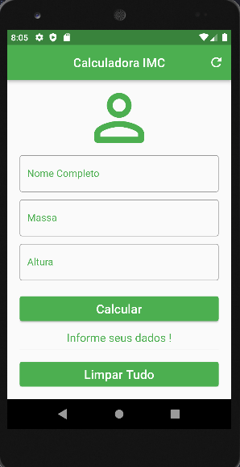
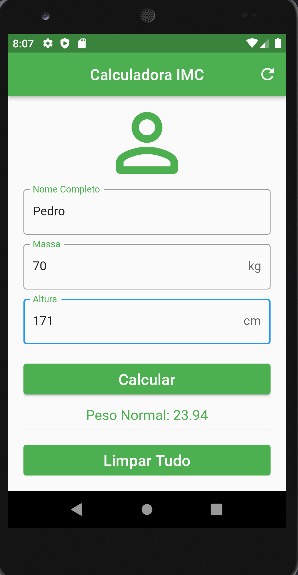
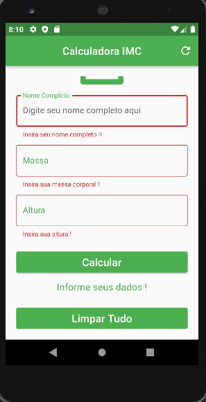

# Calculadora de IMC | BMI Calculator 

É um projeto criado com o auxílio do Prof. Daniel Ciolfi através do curso: **Criação de Apps Android/iOS/Web com Flutter - 5 cursos em 1** na Udemy. O aplicativo tem como finalidade calcular o Índice de Massa Corporal(IMC), indicando ao usuário se ele está com sua massa abaixo da média, normal, sobrepeso ou algum tipo de obesidade.

It is a project created with the help of Prof. Daniel Ciolfi through the course: **Creating Android/iOS/Web Apps with Flutter - 5 courses in 1** on Udemy. The application is intended to calculate the Body Mass Index (BMI), indicating to the user if he has his mass below average, normal, overweight or some type of obesity.

## Tela do Aplicativo | Application Screen

---

